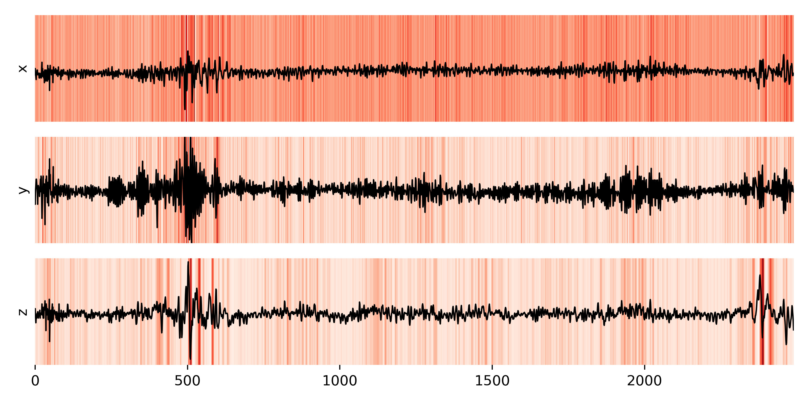

# Translating XAI to Image-Like Multivariate Time Series

This repository contains the official implementation of the paper **Translating XAI to Image-Like Multivariate Time Series**.
This project aims to translate eXplainable AI (XAI) methods developed for image data to interpret the decisions made by a machine learning model designed for crash detection based on insurance telematics data. The XAI methods investigated include Grad-CAM, Integrated Gradients, and LIME.
The project was developed within a collaboration between **Assicurazioni Generali Italia**, **ELIS Innovation Hub** and **University Campus Bio-Medico of Rome**. The insurance company deploys the model to be explained, and it is assumed to be a black box that cannot be changed to simulate a real-world scenario.

<p float="left">
  
  
  
</p>

## Installation

### Clone the repository

```bash
git clone
cd translating-xai-mts
```

### Install dependencies
#### Using virtualenv
1) First create a Python virtual environment (optional) using the following command:
```bash
python -m venv translating-xai-mts
```
2) Activate the virtual environment using the following command:
```bash
source translating-xai-mts/bin/activate
```
3) Install the dependencies using the following command:
```bash
pip install -r requirements.txt
```
#### Using Conda
For Conda users, you can create a new Conda environment using the following command:
```bash
conda env create -f environment.yml
```

The code was tested with Python 3.9.0, PyTorch 2.0.1, and Tensorflow 2.13.0.
For more informations about the requirements, please check the [requirements.txt](requirements/requirements.txt) or [environment.yml](requirements/environment.yml) files.

## Usage
1) In the [yaml file](configs/xai.yaml) under the folder configs, you can find all the settings used for each XAI method as well as other parameters;
2) We cannot share all the data used in the paper due to privacy reasons. However, we provide dummy samples created as a perturbation of the original signals in the [folder](data_share/data_raw/holdout). Note that the network is assumed to be a black box that we cannot change.
3) To run the code, and explain the network on the dummy samples, change in [yaml file](configs/xai.yaml) the following paths:
```bash
fold_dir: ./data/processed/holdout -> fold_dir: ./data_share/processed/holdout;
data_dir: ./data/data_raw/holdout  -> data_dir: ./data_share/data_raw/holdout; 
```

5) you can use the script **main.py** to obtain explanations from Grad-CAM, LIME, and Integrated Gradients:

```bash
python src/main.py.
```

If something goes wrong, please check the config file and the data path.

## Results

Here we report the results obtained explaining a crash and non-crash samples using Grad-CAM, Integrated Gradients, and LIME.
### Crash Sample

#### Grad-CAM
<p float="left">
  
</p>

#### Integrated Gradients
<p float="left">
  
</p>

#### LIME
<p float="left">
  
</p>

### Non-Crash Sample

#### Grad-CAM
<p float="left">
  
</p>

#### Integrated Gradients
<p float="left">
  
</p>

#### LIME
<p float="left">
  
</p>

## Acknowledgements

This code is based on the following papers and repositories

Papers
- [Grad-CAM: Visual Explanations from Deep Networks via Gradient-based Localization](https://arxiv.org/abs/1610.02391)
- [Axiomatic Attribution for Deep Networks](https://arxiv.org/abs/1703.01365)
- ["Why Should I Trust You?" Explaining the Predictions of Any Classifier](https://arxiv.org/abs/1602.04938)

Repositories
- [Grad-CAM](https://github.com/ramprs/grad-cam.git)
- [Integrated Gradients](https://github.com/ankurtaly/Integrated-Gradients.git)
- [LIME](https://github.com/marcotcr/lime.git)

## Contact for Issues

If you have any questions or if you are just interested in having a virtual coffee about eXplainable AI, 
please don't hesitate to reach out to me at: [l.tronchin@unicampus.it](l.tronchin@unicampus.it).

May be the AI be with you!

## License

This code is released under the MIT License.
